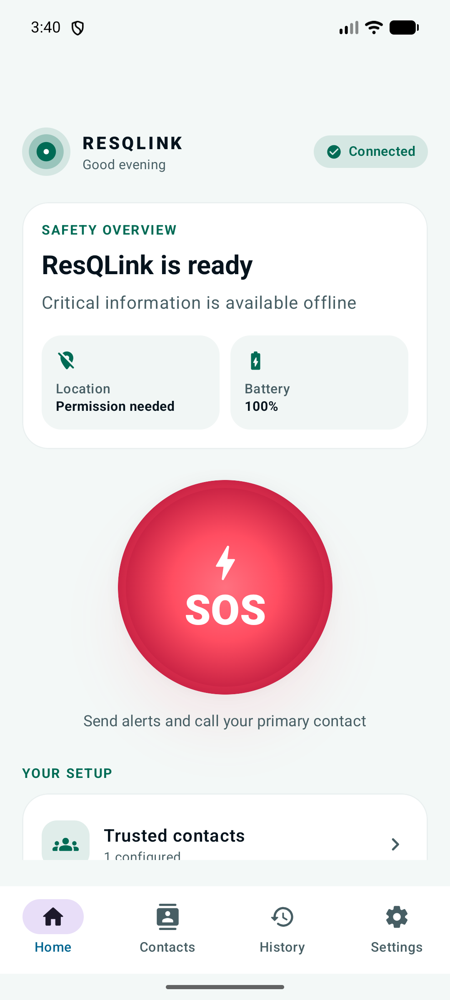
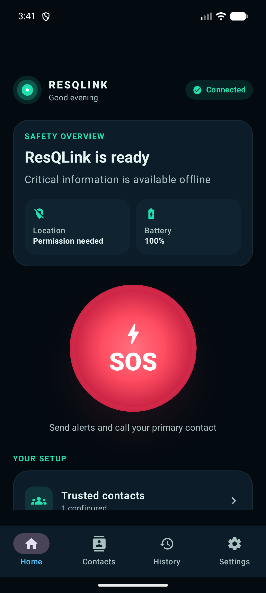
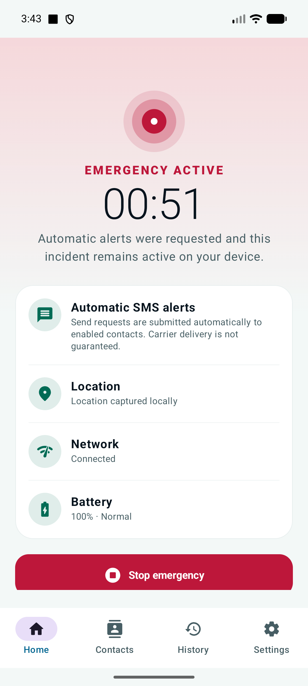
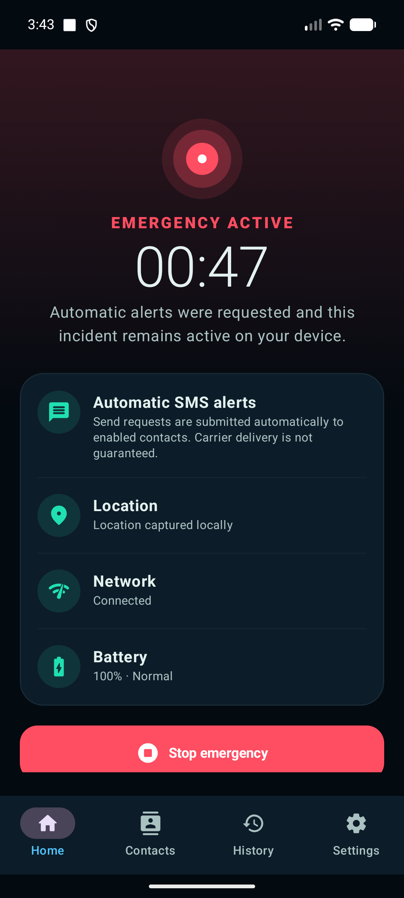

# ResQLink

ResQLink is an Android-first personal emergency communication app built around one principle: critical local functionality must remain useful when connectivity is unreliable.

This repository contains a working offline-first implementation based on the supplied product requirements. SOS becomes available after at least one enabled trusted contact and a completed emergency profile have been saved.

## What works

- Three-step first-run onboarding
- Local trusted-contact add, edit, enable/disable, duplicate detection, and deletion
- Primary call-contact selection with automatic fallback when the primary contact is removed or disabled
- Required emergency profile setup using full name and emergency notes
- Large, accessible SOS action with optional confirmation
- Contextual Android permission requests for SMS, phone, location, and notifications
- Automatic dispatch of the user-configured emergency message to every enabled trusted contact
- Automatic call initiation to the primary trusted contact
- Per-contact SMS dispatch outcome persistence without claiming carrier delivery
- Permission-aware local location capture with timeout and safe degradation
- Active emergency timer, device/network/battery status, notification, and stop flow
- Local incident history, diagnostics, data deletion, and system/light/dark themes

## Screenshots

The screens below were captured from the tested Pixel 8 API 37 emulator build after completing the required safety setup and running the SOS flow.

| Ready — light | Ready — dark |
| --- | --- |
|  |  |

| Emergency active — light | Emergency active — dark |
| --- | --- |
|  |  |

## Build

Requirements:

- Android Studio Quail 3 (2026.1.3) or compatible
- JDK 17 or newer
- Android SDK 37

```powershell
.\gradlew.bat testDebugUnitTest lintDebug assembleDebug assembleDebugAndroidTest
.\gradlew.bat connectedDebugAndroidTest
.\gradlew.bat assembleRelease
```

The debug APK is generated at `app/build/outputs/apk/debug/app-debug.apk`. The optimized release build is generated unsigned at `app/build/outputs/apk/release/app-release-unsigned.apk` and must be signed before distribution.

## SOS behavior

After explicit SOS confirmation, Android requests any missing dangerous permissions. The app atomically creates or recovers the local event, freezes one alert attempt per enabled contact, marks the incident active, then submits the configured message to every enabled phone number through `SmsManager` and starts an `ACTION_CALL` intent for the primary contact. Location capture runs independently so a slow or unavailable GPS fix cannot delay SMS or calling.

Only the message configured in Settings is transmitted automatically. Emergency-profile fields and captured coordinates remain local. SMS delivery, call connection, location accuracy, connectivity, and emergency response cannot be guaranteed; carrier charges may apply.

Google Play restricts `SEND_SMS`. A Play release must qualify for the physical-safety/emergency-alert exception and complete the relevant Permissions Declaration review.

## Technology

- Kotlin 2.4.10 with AGP built-in Kotlin
- Android Gradle Plugin 9.3.2 and Gradle 9.5
- Jetpack Compose / Material 3
- Room 2.8.4
- Hilt 2.60.1 + KSP
- DataStore, StateFlow, coroutines, and Navigation Compose

See [ARCHITECTURE.md](ARCHITECTURE.md), [SECURITY.md](SECURITY.md), [PRIVACY.md](PRIVACY.md), and [TESTING.md](TESTING.md).

## Intentionally deferred

Cloud synchronization, foreground continuous location tracking, BLE communication, a caregiver client, and server-backed delivery acknowledgements remain later-phase capabilities. They are not included in this Android repository and are not dependencies of its local SMS-and-call emergency path.
